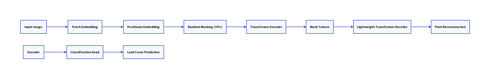
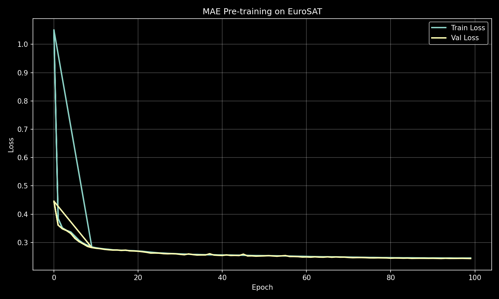
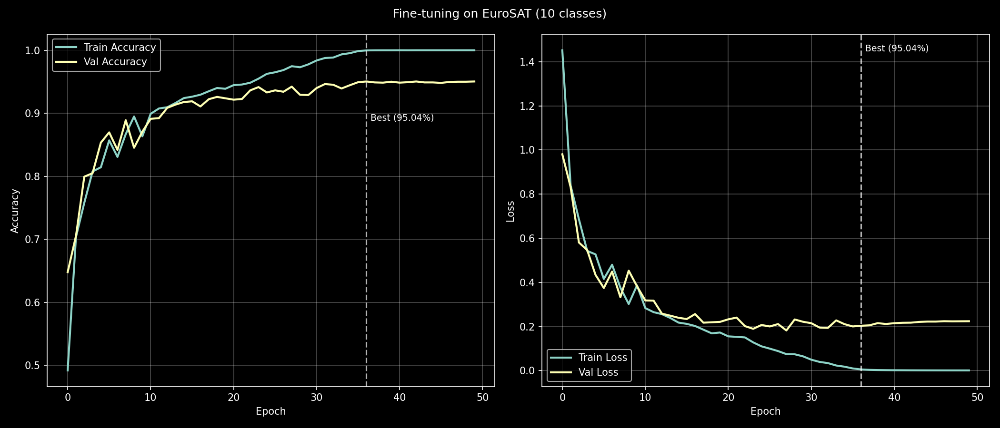
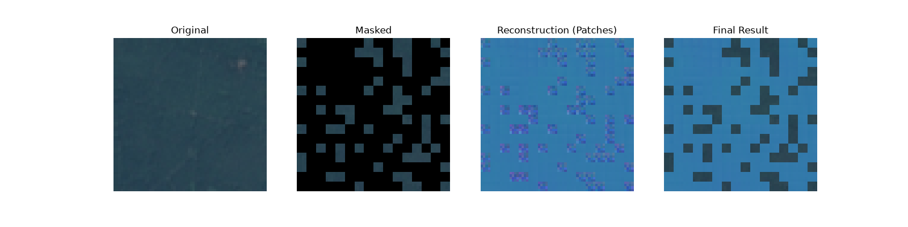
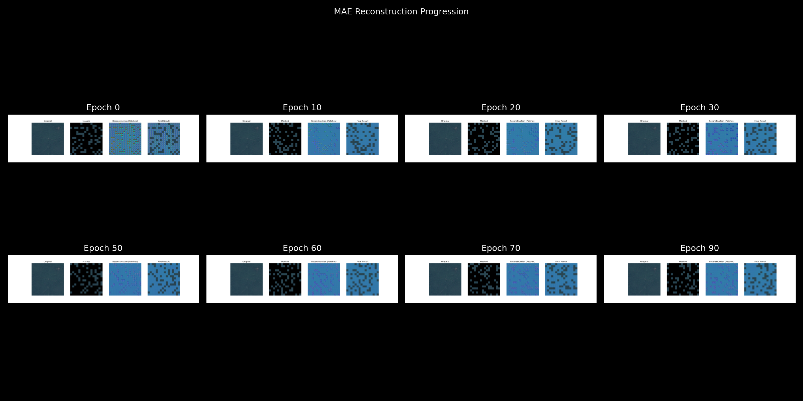
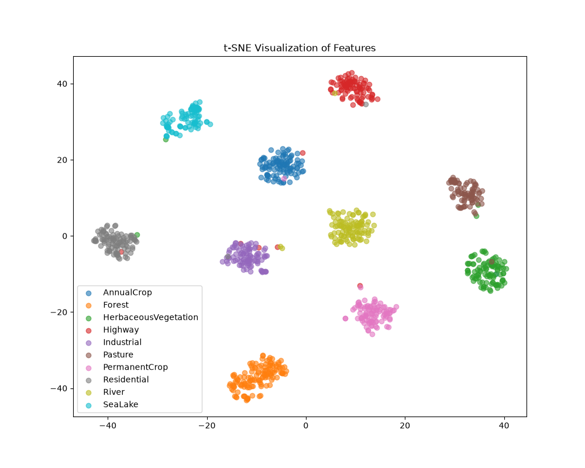

# Masked Autoencoders for Self-Supervised Representation Learning on Remote Sensing Images

## Project Overview

This project implements Masked Autoencoders (MAE) from scratch using PyTorch for self-supervised learning on satellite imagery. The goal is to pretrain an MAE on unlabeled remote sensing images and then fine-tune the learned encoder for downstream tasks, specifically land-cover classification using the EuroSAT RGB dataset. This repository is designed to be modular, research-quality, and easily extensible for future computer vision tasks in remote sensing.

## Architecture Diagram

Below is a high-level overview of the MAE architecture for both pre-training and fine-tuning phases.



## Dataset

This project utilizes the **EuroSAT RGB dataset** for both pre-training and fine-tuning. The dataset is assumed to be downloaded locally with the following structure:

```
datasets/
└── EuroSAT/
    ├── AnnualCrop/
    ├── Forest/
    ├── Highway/
    ├── Industrial/
    ├── Pasture/
    ├── PermanentCrop/
    ├── Residential/
    ├── River/
    ├── SeaLake/
    └── HerbaceousVegetation/
```

The code automatically handles the splitting of the dataset into training, validation, and testing sets using stratified sampling.

## Installation

To set up the environment, clone the repository and install the required dependencies:

```bash
git clone https://github.com/anmol1140w/mae-remote-sensing.git
cd mae-remote-sensing
pip install -r requirements.txt
```

## Training

### Pre-training MAE

To pre-train the Masked Autoencoder on the EuroSAT dataset, run the `train_mae.py` script. Configuration parameters can be adjusted in `configs/config.yaml`.

```bash
python train_mae.py --config configs/config.yaml
```

Key pre-training features:
- Mixed Precision Training
- Gradient Clipping
- Checkpoint Saving & Resuming
- Cosine Annealing Learning Rate Scheduler with Warmup
- TensorBoard Logging
- Progress Bars (tqdm)
- Random Seed Control
- Automatic Device Selection (CUDA/CPU)
- Best Model Saving

### Fine-tuning Classifier

After pre-training, the encoder can be fine-tuned for land-cover classification using the `finetune.py` script. Ensure you provide the path to the pre-trained MAE checkpoint.

```bash
python finetune.py --config configs/config.yaml --pretrained outputs/mae_eurosat_v1/pretrain/model_best.pth
```

## Inference

To perform inference on a single image using a fine-tuned model:

```bash
python inference.py --config configs/config.yaml --checkpoint outputs/mae_eurosat_v1/finetune/model_best.pth --image path/to/your/image.jpg
```

## Evaluation

To evaluate the performance of a fine-tuned model on the test set:

```bash
python evaluate.py --config configs/config.yaml --checkpoint outputs/mae_eurosat_v1/finetune/model_best.pth
```

Evaluation metrics include Accuracy, Precision, Recall, F1 Score, and Confusion Matrix. The script also generates t-SNE visualizations of feature embeddings.

## Results

| Stage | Metric | Start | Best | Final |
|-------|--------|-------|------|-------|
| Pre-training (100 epochs) | Val Loss | 0.4457 | 0.2432 | 0.2432 |
| Fine-tuning (50 epochs) | Val Accuracy | 64.78% | 95.04% (epoch 36) | 95.04% |
| Fine-tuning (50 epochs) | Val Loss | 0.9805 | 0.2034 | 0.2239 |

### Pre-training Loss

Validation loss drops from 0.4457 to 0.2432 over 100 epochs of masked reconstruction on unlabeled EuroSAT images.



### Fine-tuning Curves

After loading the pre-trained encoder, classification accuracy rises from 64.78% to **95.04%** (best at epoch 36).
Validation loss improves from 0.9805 to a best of 0.2034.



### Example Reconstructions

The model learns to reconstruct masked patches progressively.
Below is the final reconstruction snapshot (epoch 90) and the full progression across training.

**Best reconstruction (epoch 90)**



**Reconstruction progression (epochs 0–90)**



### Feature Embeddings (t-SNE)

t-SNE projection of fine-tuned encoder features on the test set.
Clusters align well with the 10 EuroSAT land cover classes.



## Future Improvements

- Extend to other remote sensing datasets (BigEarthNet, SpaceNet, DeepGlobe).
- Implement support for segmentation and change detection tasks.
- Explore different masking strategies and patch sizes.
- Integrate more advanced learning rate schedulers and optimizers.
- Add distributed training support.

## References

- [1] He, K., Chen, X., Xie, S., Li, Y., Dollár, P., & Girshick, R. (2022). Masked Autoencoders Are Scalable Vision Learners. *Proceedings of the IEEE/CVF Conference on Computer Vision and Pattern Recognition (CVPR)*, 16000-16009. [Link to paper](https://arxiv.org/abs/2111.06377)
- [2] EuroSAT Dataset: [Link to dataset](https://github.com/phelber/eurosat)
